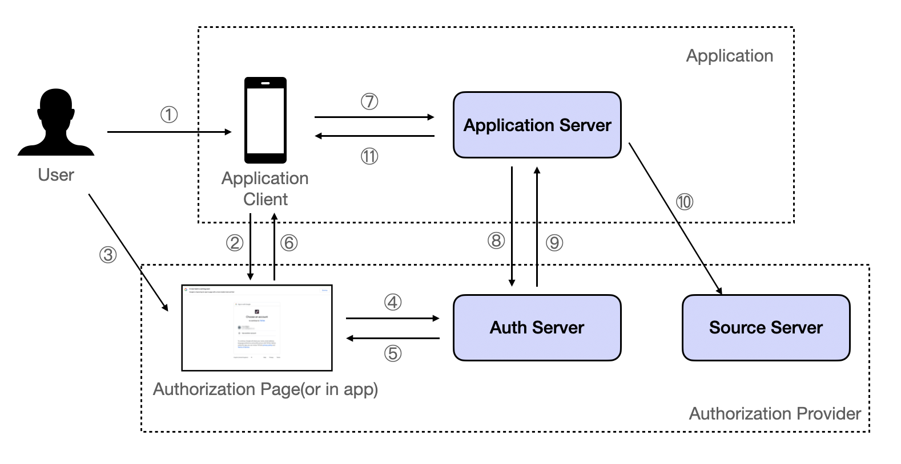
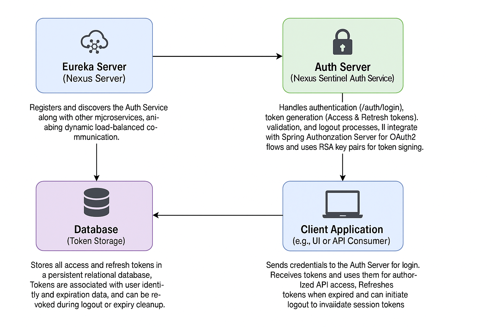

# AZOOP-Nexus-Sentinel (Auth-Server)

**Version**: `0.0.1-SNAPSHOT`  
**Developed By**: Pradeep Kushwah
**Last Updated**: June 30, 2025

---

## Overview

**The Nexus Auth Server is a secure and extensible Authentication & Authorization service**
**designed for microservices ecosystems.** **It issues and manages JWT-based access and refresh tokens, supports
role-based authentication,**
**and integrates with the Nexus ecosystem (e.g., Eureka, Spring Cloud Gateway).**

### **It offers:**

- ✅ Secure token-based authentication (JWT)

- 🔁 Refresh token lifecycle management

- 🚪 Logout mechanism with token invalidation

- 🧾 Role-based access control (RBAC)

- 🧰 Modular token storage with DB support

- 🛡️ Spring Security & Spring Authorization Server

---

# Technical and Functional Explanation

## 🧠 Technical & Functional Breakdown

---

### ***Authentication Flow***

- **Accepts credentials via `http://host:8081/auth/login`**
- **Verifies user credentials using Spring Security**

---

### 🔐 Token Issuance

**Issues two secure tokens upon successful authentication:**

- 🔓 **Access Token** – Short-lived (e.g., 15 mins), used for accessing secured APIs
- ♻️ **Refresh Token** – Long-lived (e.g., 7 days), used to obtain new access tokens when expired

- **Token Security**:  
  Tokens are signed using **RSA private keys**, ensuring authenticity and tamper-proofing. Each token is stored in the *
  *`TokenRepository`** with metadata like type (ACCESS/REFRESH), expiry, revocation status, and subject (user ID).

- **Token Tracking & Revocation**:  
  Tokens are stored persistently in a **relational database**, allowing the system to:
    - Detect expired or revoked tokens
    - Invalidate tokens during logout or manual admin actions

---

### 🧩 Authorization Server Integration

- Built on **Spring Authorization Server**:
    - Exposes OAuth2-compliant endpoints (e.g., `/oauth2/token`, `/oauth2/introspect`)
    - Supports the **Authorization Code**, **Password**, and **Client Credentials** grant types
    - Integrates with **JWT tokens**, automatically issuing and validating signed tokens
    - Custom claim generation for role-based access (`roles`, `sub`, `exp`, etc.)

---

### 🚪 Logout Mechanism

- **Endpoint**: `POST http://host:8081/auth/logout`
- **Flow**:
    - Extracts and validates the `Authorization: Bearer <access_token>` header
    - Revokes the access token and its corresponding refresh token
    - Deletes token entries from the database or marks them as expired
    - Responds with `200 OK` to confirm session termination

- **Security Practice**:  
  Complies with JWT logout best practices by:
    - Not relying on JWT expiry alone
    - Explicitly revoking both tokens to prevent replay attacks

---

### 🧾 Token Storage & Lifecycle Management

- **Database-Backed Token Repository**:
    - Stores all issued access and refresh tokens
    - Associates each token with the user/client (`subjectId`)
    - Maintains token metadata: type, expiration, and revocation flags

- **Revocation Logic**:
    - During logout or abnormal sessions, both tokens can be marked as revoked
    - Tokens are checked against this repository on each authentication

- **Automatic Cleanup Policy**:
    - A scheduled task or database TTL configuration can be enabled to purge expired tokens
    - Keeps the repository clean and scalable

---

## 🧠 Architecture Overview

The Nexus Traffic Manager operates as a reactive API Gateway, orchestrating communication between the **Nexus Server** (
Eureka-based service registry) and downstream microservices like the PIGEON service. Below is a textual description of
the flow, followed by a placeholder for an image-based flow diagram:

### 🔄 Flow Description

1. **User Authentication Request**:  
   A user/client sends a `POST` request to `http://host:8081/auth/login` with valid credentials (username & password).

2. **Credential Validation via Spring Security**:  
   Spring Security authenticates the credentials using a custom `UserDetailsService` and password encoder (e.g.,
   BCrypt).

3. **Token Generation via Authorization Server**:  
   Upon successful authentication:

- An **Access Token** (JWT, short-lived) and a **Refresh Token** (JWT, long-lived) are generated.
- Tokens are signed using RSA keys and stored in the database via the `TokenRepository`.

4. **Token Persistence & Mapping**:  
   Both tokens are saved with metadata (user, expiry, type) to support tracking, revocation, and auditing.

5. **Client Usage of Tokens**:

- The client uses the **Access Token** in the `Authorization: Bearer <token>` header for secure endpoints.
- Once expired, the client can use the **Refresh Token** via `/auth/refresh` to obtain a new access token.

6. **Logout & Token Revocation**:  
   A call to `POST /auth/logout`:

- Extracts the access token from the request
- Revokes both access and refresh tokens in the database
- Ensures the session is fully terminated and tokens cannot be reused

7. **Token Introspection (Optional)**:  
   Internal or third-party services can validate token status using the `/oauth2/introspect` endpoint provided by Spring
   Authorization Server.

### 📈 Nexus Sentinel Auth Server Flow Diagram



---

### 📈 Nexus Sentinel Auth Flow Diagram



---

- **Eureka Server (Nexus Server)**:  
  Registers and discovers the **Auth Service** along with other microservices, enabling dynamic load-balanced
  communication.

- **Auth Server (Nexus Sentinel Auth Service)**:  
  Handles authentication (`/auth/login`), token generation (Access & Refresh tokens), validation, and logout processes.
  It integrates with **Spring Authorization Server** for OAuth2 flows and uses RSA key pairs for token signing.

- **Database (Token Storage)**:  
  Stores all access and refresh tokens in a persistent relational database. Tokens are associated with user identity and
  expiration data, and can be revoked during logout or expiry cleanup.

- **Client Application (e.g., UI or API Consumer)**:  
  Sends credentials to the Auth Server for login. Receives tokens and uses them for authorized API access. Refreshes
  tokens when expired and can initiate logout to invalidate session tokens.

---

## 🔧 Prerequisites

- **Java**: JDK 17+
- **Maven**: 3.6.0+
- **MongoDB**: Running at `localhost:27017` (configurable)
- **IDE**: IntelliJ IDEA (recommended)

---

## 🚀 Setup Instructions

### Clone the Repository

```bash
git clone <repository-url>
cd DSC-Nexus-Sentinel
```

---

## Configure Environment

### - **Start MongoDB**: Update spring.data.mongodb.uri in application.yaml if using a different host/port.

### - **Install dependencies**: mvn clean install

## Import into IntelliJ

- **Open IntelliJ IDEA.**

- **Select File** > Open and choose **pom.xml.**

- **Wait for indexing and dependency resolution.**

---

## ⚙️ Configure application.yaml

### - Edit  **src/main/resources/application.yaml**:

### 📁 `application.yaml` Configuration

```yaml
server:
  port: 8092

spring:
  auth:
    allowed:
      end:
        uri:
          patterns:
            - /auth/**
            - /api/**
          admins:
            - /user/**
  jackson:
    serialization:
      INDENT_OUTPUT: true
  security:
    user:
      name: admin
      password: admin@123#

# JWT Configuration
jwt:
  issuer: nexus-auth
  secret: ZGFpbWxlci10cnVja3MtbmV4dXMtYXV0aC1zZXJ2aWNlLXNlY3JldC1rZXk=
  access.token.time.to.expire: 15 #in min
  refresh.token.time.to.expire: 30 #in days

# Logging
logging:
  level:
    org.springframework.security: DEBUG
    root: INFO
    com.daimlertrucksasia.it.dsc.nexus: DEBUG

# Actuator (optional)
management:
  endpoints:
    web:
      exposure:
        include: health,info

```

---

## ▶️ Run the Application

### - **Right-click: NexusSentinelApplication.java and select Run.**

### - **Or use**:Maven CLI

```bash
mvn spring-boot:run
```

---

## Verify Setup

### Start the Auth server at http://localhost:8092.

- **Ensure the Auth service is registered with Eureka.**
- **Test the Client Registration endpoint**:

```shell
curl --location 'http://localhost:8092/api/register/client' \
--header 'Content-Type: application/json' \
--data '{
    "clientId": "test-client",
    "clientSecret": "my-secret",
    "roles": [
        "ADMIN",
        "USER"
    ],
    "scopes": [
        "read",
        "write"
    ],
    "grantTypes": [
        "client_credentials",
        "refresh_token"
    ],
    "allowedTokenTypes": [
        "BEARER_JWT",
        "OPAQUE"
    ],
    "team": "PlatformTeam",
    "serviceTier": "premium"
}'
````

- **Test the User Registration endpoint**:

```shell
curl --location 'http://localhost:8080/api/register/user' \
--header 'Content-Type: application/json' \
--data-raw '{
    "username": "pradeep.doe",
    "password": "StrongPassword123!",
    "roles": [
        "ROLE_USER",
        "ROLE_ADMIN"
    ],
    "allowedTokenTypes": [
        "BEARER_JWT"
    ],
    "active": true,
    "department": "Engineering",
    "region": "APAC",
    "email": "jane.doe@example.com"
}'
````

- **Test the client login endpoint(Generate JWT Token)**:

```shell
curl --location 'http://localhost:8080/auth/client/login' \
--header 'Content-Type: application/json' \
--data '{
    "clientId":"test-client",
    "clientSecret":"my-secret"
}'
````

- **Test the user login endpoint(Generate JWT Token)**:

```shell
curl --location 'http://localhost:8080/auth/user/login' \
--header 'Content-Type: application/json' \
--data '{
    "username":"jane.doe",
    "password":"StrongPassword123!"
}'
````

---

### - **Check IntelliJ console for DEBUG logs.**

# 📬 Contact : 7477262440

### Developer: AZOOP SOFTWARE INFO SYSTEMS

### Email: kushwahpradeep531@gmail.com

### Organization: Azoop Software Info Systems


